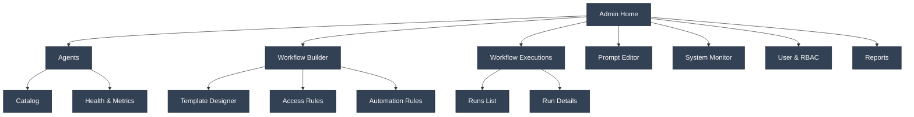

# Admin UX/UI Current State Summary

Version: 2025-08-08

## Purpose
Summarize current Admin experience across agent management, prompts, workflow templates/executions, system monitoring, and user/RBAC, with emphasis on modular, agent-based workflows.

## Primary Admin Areas (UI)
- `admin/agents` (`agent-manager.tsx`): catalog of available agents; selection and configuration UI exists; enhanced selection component provides health and metrics.
- `admin/workflow-builder` (`workflow-builder.tsx`): scaffolded; intended to assemble agent-based steps into reusable templates.
- `admin/workflow-executions`: list/inspect in-flight or completed runs; planned to use task/pipeline status.
- `admin/prompt-editor` (`prompt-editor.tsx`): manage prompt templates and versions.
- `admin/system-monitor` (`system-monitor.tsx`): health endpoints, queue status, worker stats.
- `admin/user-manager` (`user-manager.tsx`): user and roles management (wiring in progress).
- `admin/report-exporter` (`report-exporter.tsx`): generate PDF/JSON/CSV outputs (planned).

## Current Backend Coverage (high-level)
- Agents: discovery, health monitor, validator; list and health APIs; caching in place.
- Workflows: workflow templates and executions modeled in DB; endpoints scaffolded; UI partial.
- Tasks: enqueue step(s), status, cancel; WebSocket notifications.
- RBAC: baseline permissions enforced for pipelines, agents, KB; taxonomy evolving.

## Current Admin Flows (as implemented/near-term)
1) Review agent catalog
   - Health/metrics visible per agent
   - Toggle availability and view requirements

2) Configure prompts
   - Select step → choose active template version → preview.

3) Execute/manage pipelines and tasks
   - Trigger background steps → monitor via WebSocket; fallback to polling.

4) Workflow templates (partial)
   - Define steps: agent type, inputs, review gate, confidence thresholds.
   - Persist as template; assign access rules (planned wiring to RBAC).

## Admin Constraints & Gaps
- Workflow Builder UI not fully wired to template APIs.
- No explicit audit trail UI (though logs exist).
- KB management permission uses `AGENT_MANAGE` temporarily.
- Report exporter UX not implemented.

## Admin IA & Navigation (Mockup)

## Admin UI Patterns
- Two-pane layouts for editors (list/detail).
- Sticky headers for template/run context.
- Inline validation with clear error summaries.
- Secondary actions: export JSON, copy IDs, trigger test runs.

## Security & Access
- Roles: Administrator, Analyst, Viewer; client-scoped users supported.
- Workflow access rules planned: template-level allow lists (roles, users, clients).

