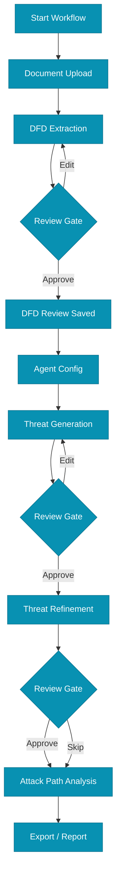
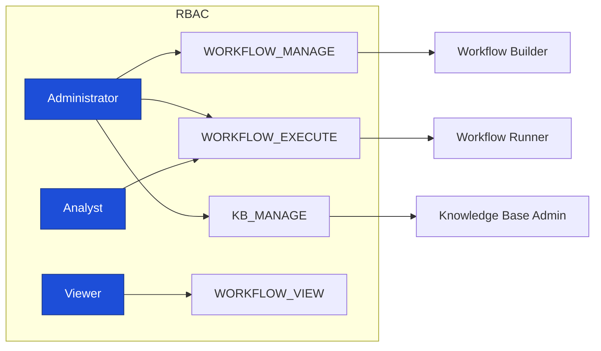

# Future UX/UI Improvements and Admin Workflow Design

Version: 2025-08-08

## Goals
- Deliver a cohesive, stateful, pipeline-first UI connected exclusively to modern APIs.
- Provide a first-class Admin experience to configure and govern reusable, agent-based workflows.
- Ensure workflows are discoverable and usable by authorized users with review-by-default gates and optional automation.

## Non-Negotiables (from requirements)
- **Admin Workflow Window**: A dedicated admin area to set up full workflows composed of agents that can connect to web search and RAG.
- **Access Control**: Workflows are only accessible to users with explicit workflow rights (role- and client-scoped).
- **Automation Toggle**: Per-step automation toggle; default is manual pause for review; users can opt-in to auto-advance.
- **Threat Modeling Template**: Provide a complete workflow template covering the legacy flow end-to-end.

## Admin Workflow Builder: UX Blueprint

### Information Architecture
- `Admin → Workflow Builder`
  - Templates list
  - Template Designer (steps, agents, inputs)
  - Access Rules (roles, users, clients)
  - Automation Rules (confidence thresholds, auto-advance, pause gates)
  - Integrations (Web Search, RAG sources)

### Designer Layout (Mockup)
```mermaid
flowchart LR
  L[List of Templates] --- D[Workflow Designer]

  subgraph D[Template: Threat Modeling]
    DIR[Left: Step Palette]\n- Document Upload\n- DFD Extraction\n- DFD Review\n- Agent Configuration\n- Threat Generation\n- Threat Refinement\n- Attack Path Analysis
    CAN[Center: Canvas]\nDrag steps here → reorder → connect
    PROP[Right: Properties]\nAgent settings, RAG, Web Search, Review Gate, Confidence
  end

  D --> ACC[Access Rules]
  D --> AUTO[Automation]
  D --> INTEG[Integrations]

  classDef panel fill:#0f172a,stroke:#1f2937,color:#fff
  class L,D,DIR,CAN,PROP,ACC,AUTO,INTEG panel
```

### Step Properties (per step)
- **Agent**: choose agent type (Architectural, Business, Compliance, Custom)
- **Inputs**: required data from previous steps (DFD, threats, feedback)
- **RAG**: knowledge sources to query; top-k; filters
- **Web Search**: enable/disable; provider config
- **Review Gate**: required/optional; approvers; checklist; diff view
- **Automation**: allow auto-advance; default off; confidence threshold for auto-approve

### Access Rules
- Roles: `Administrator`, `Analyst`, `Viewer`
- Workflow permissions: `WORKFLOW_VIEW`, `WORKFLOW_EXECUTE`, `WORKFLOW_MANAGE`
- Client scoping: restrict templates to `client_id` set(s)

## End-User Workflow Runner: UX Blueprint

### Flow (Review-by-default with optional auto)


### Runner Controls
- Topbar: Template name, execution ID, overall progress, pause/resume.
- Sidebar: Steps with status badges (Queued, Running, Review, Approved).
- Main: Step content with live logs, inputs/outputs, and action buttons.
- Review Gate: change diff, checklist, Approve/Request Changes, and optional comment.
- Auto-advance toggle: execution-level and per-step; defaults off.

## Concrete Improvements List
- **Platform Unification**: Refactor frontend `api.ts` and `store.ts` to use `/api/pipeline/*`, `/api/tasks/*`, `/ws/{pipeline_id}` exclusively.
- **Workflow Builder UI**: Implement `admin/workflow-builder` designer with drag/drop, step properties, and persistence to `workflow_templates`. Surface prompt chaining controls per step, e.g. `optional_parameters.existing_threats_limit`.
- **Workflow Execution UI**: Implement `admin/workflow-executions` + client runner page. Link to `workflow_executions` and tasks.
- **RBAC Expansion**: Add `KB_MANAGE`, `WORKFLOW_MANAGE`, `WORKFLOW_EXECUTE`; seed defaults and enforce in endpoints/UI.
- **Audit Trail UI**: Project/session history with step logs, approvals, feedback, exports.
- **Report Exporter**: One-click PDF and JSON/CSV exports post-refinement.
- **Accessibility**: WCAG 2.1 AA audit, theme toggle, keyboard nav, ARIA improvements.
- **Observability in UI**: Health dashboards, agent metrics, task monitor.

## Threat Modeling Template (Admin Default)
```json
{
  "name": "Threat Modeling (Standard)",
  "description": "End-to-end threat modeling with DFD, multi-agent threats, refinement, and optional attack paths.",
  "steps": [
    {"id": "document_upload", "agent_type": "document_analysis", "review_required": false, "automation_enabled": true},
    {"id": "dfd_extraction", "agent_type": "data_flow_analysis", "review_required": true, "automation_enabled": false},
    {"id": "architectural_agent", "agent_type": "architectural_risk", "review_required": true, "automation_enabled": false, "optional_parameters": {"existing_threats_limit": 50}},
    {"id": "business_agent", "agent_type": "business_financial", "review_required": true, "automation_enabled": false, "optional_parameters": {"existing_threats_limit": 50}},
    {"id": "compliance_agent", "agent_type": "compliance_governance", "review_required": true, "automation_enabled": false, "optional_parameters": {"existing_threats_limit": 50}},
    {"id": "threat_refinement", "agent_type": "threat_refinement", "review_required": true, "automation_enabled": false},
    {"id": "attack_path_analysis", "agent_type": "attack_path_analyzer", "review_required": false, "automation_enabled": true}
  ],
  "automation_settings": {"default_auto": false, "confidence_threshold": 0.9},
  "client_access_rules": {"roles": ["Analyst", "Administrator"], "clients": "any"}
}
```

## Admin Access & Rights Mockup


## Implementation Notes
- Extend existing DB tables `workflow_templates`, `workflow_executions`; add permissions to roles seed.
- Expose admin APIs (`/api/admin/workflows`) and secure with new permissions.
- Use WebSocket events for review gate transitions; persist approvals and comments.
- Provide execution-level toggle for automation; enforce default pause after each step when off.

## Success Criteria
- Admins can design, save, and publish workflows with RAG + Web Search integrations.
- Authorized users can start and complete those workflows with review gates by default.
- Optional automation can auto-approve steps above confidence threshold; otherwise pause for manual review.
- Threat Modeling template covers legacy flow end-to-end.


